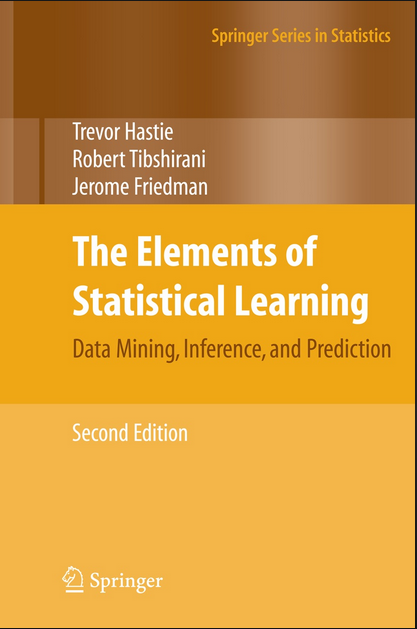

# Solutions to Elements of Statistical Learning

This repo contains solutions to exercises at the end of the book: Elements Of Statistical Learning by by Trevor Hastie, Robert Tibshirani, and Jerome Friedman.

* [Chapter 3: Linear Methods for Regression](Ch3)
* [Chapter 4: Linear Methods for Classification](Ch4)
* [Chapter 7: Model Assessment and Selection ](Ch7)
* [Chapter 8: Model Inference and Averaging](Ch8)

Solutions by: Amit Kushwaha (amit.kushwah@gmail.com)

